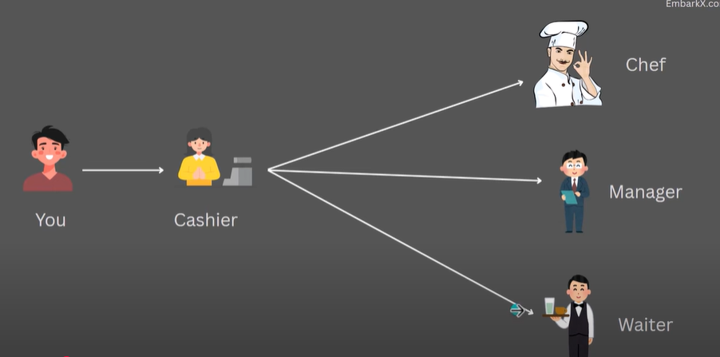
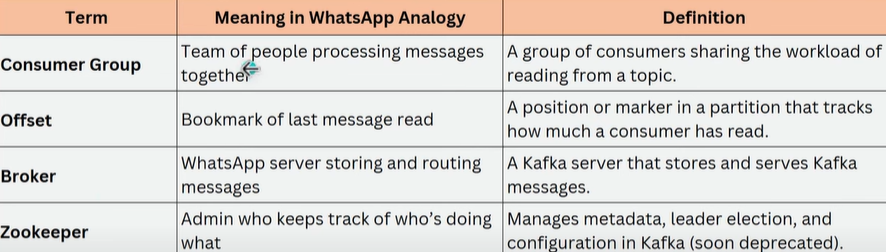

# Introduction to Apache Kafka Notes

This file will contain my notes as I learn about Apache Kafka and its integration with Spring Boot.

---

## Getting Started
- What is Apache Kafka?
- Why use Kafka with Spring Boot?
- Key concepts and terminology

Add your notes below as you progress!

Apache kafka is an open source distributed event streaming platform.

This is inefficient as cashier has to go everywhere.

Now this digital display will act as apache kafka.

How kafka helps =>
1. Decoupling servicres 
2. Scalability 
3. Replayability 
4. Efficiency 

Event streaming means continuously capturing events (data) in real time, storing them in a log (like a timeline) and allowing systems to react to them - either immediately or later.

Kafka is like a whatsapp group.

Ways to pass the data =>

Difference between Kafka and RabbitMQ =>

Kafka Architecture and its components =>

Event : Something happend + its data
Producer : Someone who produces the events 
Consumer : someone who consumes the events 
Topics : Seggregation between kafka / Seperation of concerns 
Partitions : further seggregatin in topic itself
Consumer Groups : team of consumer to consumer message quickly
Consumer rebalancing : its a process of redistributing the topic's partition among the consumers within the consumer group. This ensures that consumer is assigned to fair share of partitions to read and process. It happens automatically.
Offset : Its a bookmark for showing the last message read.

Zookeeper manages instances of kafka running together in a cluster to share load. Now it is coming inbuild in kafka.

docker run -d --name zookeeper -p 2181:2181 -e ZOOKEEPER_CLIENT_PORT=2181 -e ZOOKEEPER_TICK_TIME=2000 confluentinc/cp-zookeeper:7.5.0

docker run -d --name kafka -p 9092:9092 -e KAFKA_BROKER_ID=1 -e KAFKA_ZOOKEEPER_CONNECT=zookeeper:2181 -e KAFKA_ADVERTISED_LISTENERS=PLAINTEXT://localhost:9092 -e KAFKA_OFFSETS_TOPIC_REPLICATION_FACTOR=1 --link zookeeper confluentinc/cp-kafka:7.5.0

docker exec -it kafka bash

kafka-topics --create --topic my-topic --bootstrap-server localhost:9092 --partitions 3 --replication-factor 1

kafka-topics --list --bootstrap-server localhos
t:9092

kafka-topics --describe --topic my-topic --bootstrap-server localhost:9092

kafka-console-producer --topic my-topic --bootstrap-server localhost:9092

docker exec -it kafka bash

kafka-console-consumer --topic my-topic --bootstrap-server localhost:9092 --from-beginning